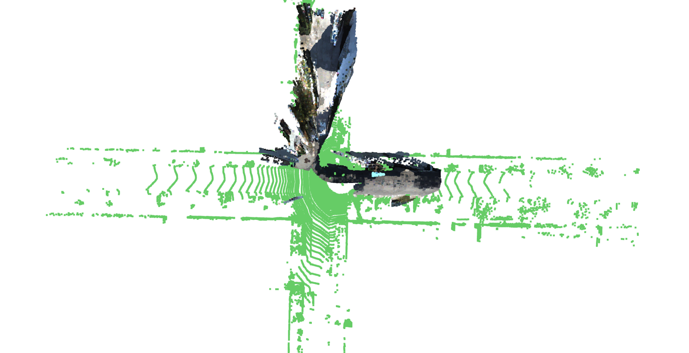
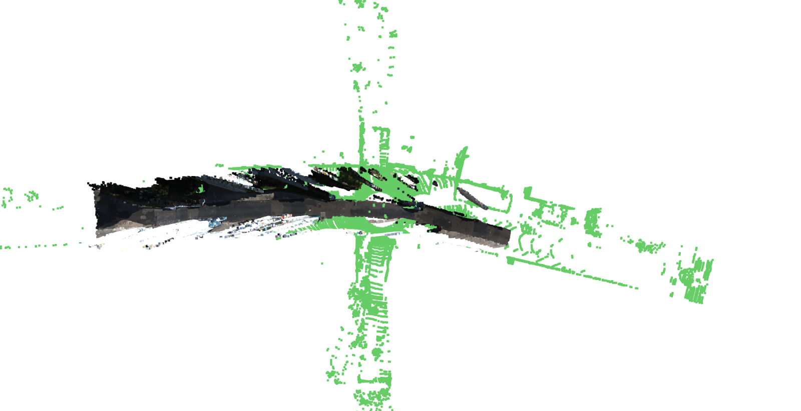
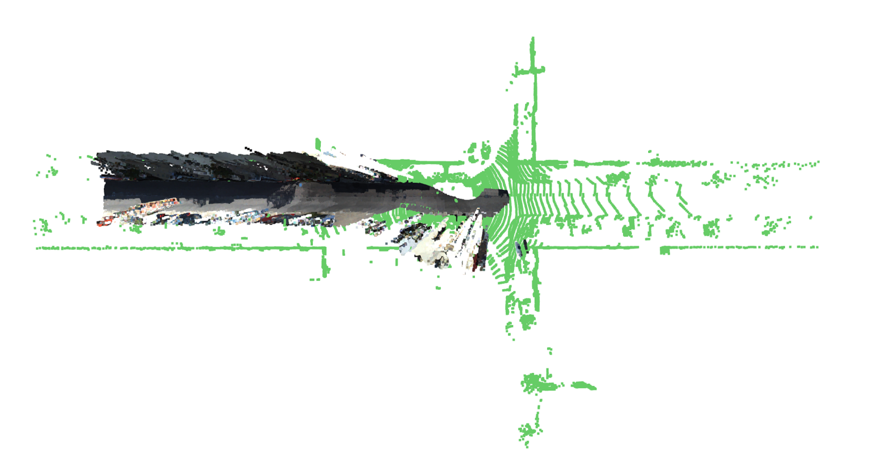

# [AAAI-24] KITTI CrossSource Dataset Toolkit: A Large-Scale Outdoor Cross-Source Point Cloud Dataset

This repository contains the code for the KITTI CrossSource Dataset Toolkit. The toolkit is designed to create KITTI CrossSource dataset from KITTI Odometry. KITTI CrossSource dataset is a large-scale outdoor cross-source point cloud dataset derived from the popular KITTI Odometry dataset. It contains 11 sequences, and is much larger than existing datasets such as [3DCSR](http://multimediauts.org/3D_data_for_registration/). 
 

[[arxiv](https://arxiv.org/abs/2312.08664)]


[](https://github.com/kezheng1204/KITTI-CrossSource/issues)
[](https://github.com/kezheng1204/KITTI-CrossSource/fork)
[](https://github.com/kezheng1204/KITTI-CrossSource/stargazers)
[](https://github.com/kezheng1204/KITTI-CrossSource/blob/master/LICENSE)

| Example Pair #1|Example Pair #2|Example Pair #3|
|-----------------------|---------------------|-----------------------|
||||


## Highlights

- First outdoor cross-source point cloud dataset.
- Sufficiently presents the challenges of the cross-source point cloud registration task, namely 1) Noise and outliers. 2) Density difference. 3) Partial overlap. 4) Scale difference.

## Usage

The toolkit relies on [MonoRec](https://github.com/Brummi/MonoRec) to create reconstructed point clouds from images. The repository is included as a submodule. To clone the repository with the submodule, use the following command:

```bash
git clone --recurse-submodules https://github.com/kezheng1204/KITTI-CrossSource.git
```

To create the KITTI CrossSource dataset, follow the steps below:

- Install the dependencies following the instructions in the MonoRec repository. Additionally, download their official pretrained model from their repository.

- Download the KITTI Odometry dataset from the [official website](http://www.cvlibs.net/datasets/kitti/eval_odometry.php) and unpack it into the `data` folder.

- Run reconstruct_pcd.py to create reconstructed point clouds:

```bash

python reconstruct_pcd.py --config seq_configs/pointcloud_monorec_all_00.json

```

An example configuration file is provided in `seq_configs/pointcloud_monorec_all_00.json`. The configuration file specifies the sequence name, the path to the KITTI Odometry dataset, and the path to the MonoRec model checkpoint. 

For convenience, we provide a script to downsample the PLY-format point clouds and convert them to the common NPY format. Run the following command:

```bash
python downsample_pcd.py
```

It is required that the dataset is organized as follows:

```text
Kittis
    |--sequences--00--velodyne--000000.bin
    |              |         |--...
    |              |--rec--000000.ply
    |              |    |--...

```

## Benchmark
Coming Soon.

## Data Download
Coming Soon.
