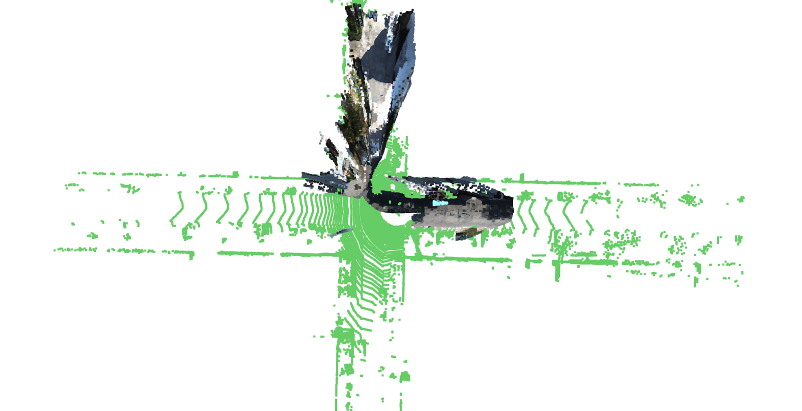
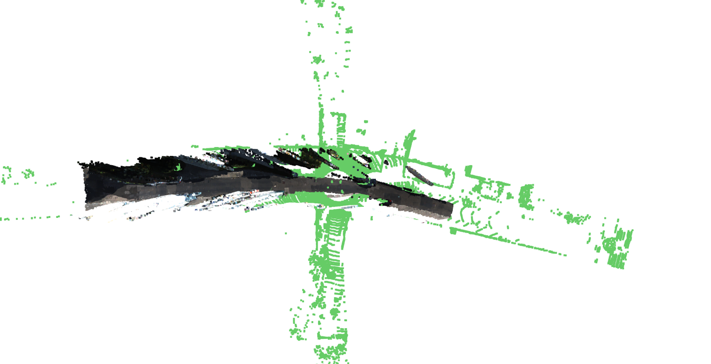
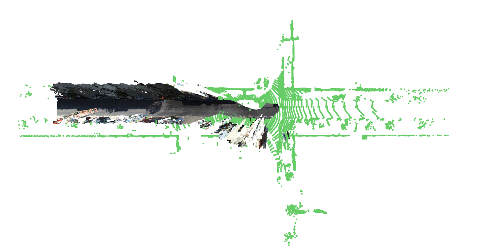

# [AAAI-24] KITTI-CrossSource: A Large-Scale Outdoor Cross-Source Point Cloud Dataset

[[arxiv](https://arxiv.org/abs/2312.08664)]

KITTI CrossSource dataset is a large-scale outdoor cross-source point cloud dataset derived from the popular KITTI Odometry dataset. It contains 11 sequences, and is much larger than existing datasets such as [3DCSR](http://multimediauts.org/3D_data_for_registration/). 

| Example Pair #1|Example Pair #2|Example Pair #3|
|-----------------------|---------------------|-----------------------|
||||

## Highlights

- First outdoor cross-source point cloud dataset.
- Sufficiently presents the challenges of the cross-source point cloud registration task, namely 1) Noise and outliers. 2) Density difference. 3) Partial overlap. 4) Scale difference.

## Benchmark

Coming Soon.

## Download
Coming Soon.
